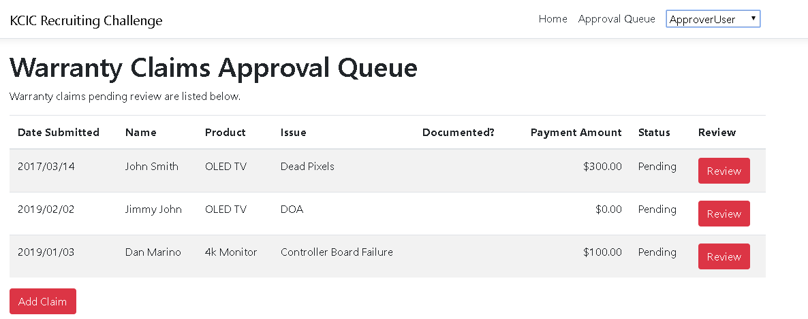
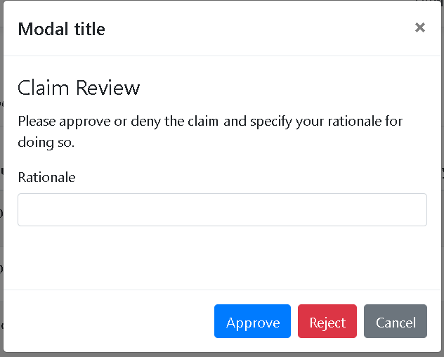

# KCIC Recruiting Challenge

Please read the entirety of this document before beginning. 

## Tasks

Your mission, should you choose to accept it is to:

*   Protect the Approval Queue route from unauthenticated users, showing an error page when the route is accessed explicitly (done)
*   Implement the ability to review claims in the queue (i.e. accept/reject with a reason provided) ~
*   Add a status column to the Queue to display the status of each claim. (done)
*   Order the queue such that un-reviewed claims (those with "Pending" status) appear at the top of the queue; the rest of the queue should be sorted in ascending order. (done)

There is a time expectation of rougly 2 hours for this challenge, and you are free to use whatever resources you wish in completing it.


## Business Logic Rules

*   Only authenticated users can view the queue (done)
*   Only authenticated users can see the nav button for the queue (done)
*   Unauthenticated users who manually navigate to the **queue** route should be shown an error page indicating the need to login. (done)
*   Only authenticated users can add new warranty claims to the queue (done)
*   Only ApproverUser can approve/reject warranty claims in the queue (done)
*   Warranty claim approval and rejection each require a rationale (ReviewRationale) to be provided by the end user.
*   Submitter user cannot approve any claims. (done)
*   ApproverUser cannot review (approve/reject) claims they have submitted themselves.
*   An approved claim should be set to status "Approved" and a rejected claim set to the status "Rejected". (done)


## Project Notes

This project was bootstrapped with [Create React App](https://github.com/facebookincubator/create-react-app).

* The server-side application is built with .NET 5 (you _must_ have this version of the SDK installed unless you are using the Remote Containers extension below)
* The client-side application relies on `npm` for package management, which must also be installed.
* There are no database dependencies for this application
* The application manages state using [react-redux](https://react-redux.js.org/introduction/basic-tutorial) and all actions and reducers are located in `/KCICApprovalQueue/src/store`
* The application can be run through Visual Studio, or from the command line using ```dotnet run --project KCICApprovalQueue```
  * Be sure to install the `npm` packages on which this project relies by running `npm install` from within `KCICApprovalQueue/ClientApp`
* **Alternatively**, you may find it easier to use the [Remote - Containers](https://marketplace.visualstudio.com/items?itemName=ms-vscode-remote.remote-containers) VS Code extension that will allow you to open the project within a [Docker](https://www.docker.com/) container that already has .NET 5 and node/`npm` installed
  * You _must_ have [Docker](https://www.docker.com/) installed to use this method
  * Once you install the extension and open the repository as a folder in VS Code, you can choose `Remote-Containers: Reopen in Container` from the command palette (open the command palette via `Ctrl-Shift-P`)
* By default, you can access the running web application at [http://127.0.0.1:5000/](http://127.0.0.1:5000/)

## Submission instructions
*   **[Create a private fork of this repository](https://confluence.atlassian.com/bitbucket/files/304578655/933101240/2/1509043649379/fork.gif), named ApprovalQueue_yourlastname** and provide read access to Bitbucket user **crookc**
* Please **create a feature branch off of the ```master``` branch entitled: ```feature/lastname``` (substituting in your last name)**
* Make as many or as few commits to that branch as necessary to that branch, and **submit a pull request into the ```master``` branch when finished**.


If you have any questions please contact the development team at [developers@kcic.com](mailto:developers@kcic.com)

### Tips

*   Unit and integration tests are encouraged but not required.
*   Project is a **create-react-app** template utilzing Redux for global state.
*   **react-jsonschema-form** is utilized for form creation on the existing **AddClaimModal** and is pre-populating values to make manual testing less tedious.
*   Data persistence is provided by a static class, not a database, for simplicity.
*   "Authentication" is faked and the current user (as selected by the dropdown in the header) is available in the global state store at **state.auth.currentUser.**
*   **BaseService** injects a "FakeAuth" header that contains the current user's username
*   FakeAuthMiddleware is used to generate a ClaimsIdentity server-side, available from **HttpContext.User.Identity**
*   **submitter** and **approver** roles are also built into the ClaimsIdentity


## UI Examples

#### Queue



#### Review Modal



